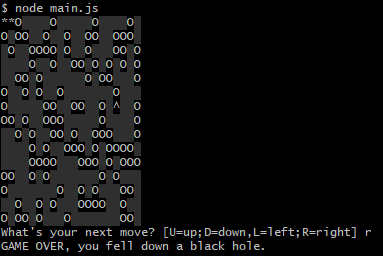

# The Interactive Hat Game

> A player has lost his hat in a field full of holes, and he must navigate back to it without falling down one of the holes or stepping outside of the field.

## Table of contents

* [General info](#general-info)
* [Screenshots](#screenshots)
* [Technologies](#technologies)
* [Setup](#setup)
* [Features](#features)
* [Status](#status)
* [Inspiration](#inspiration)
* [Contact](#contact)

## General info

The purpose of this project is to help me to better understand JS classes and to have fun with this game.

## Screenshots



## Technologies

* JavaScript - version ES6
* Node.js - version 12.19.0.

## Setup

Please use Node.js to run the program in your local environmnet.
Make sure you have Node and NPM installed
Run npm install prompt-sync in the terminal

## Code Examples

Examples of message building blocks:

```javascript

  playGame() {
    let gameOver = false;

    // Generate new hat position
    do {
      this.hat.x = Math.floor(Math.random() * this.field[0].length);
      this.hat.y = Math.floor(Math.random() * this.field.length);
    } while (this.hat.x === this.start.x && this.hat.y === this.start.y);
    // Update game board with new hat position
    this.field[this.hat.y][this.hat.x] = hat;

    // Add start position to game board
    this.field[this.start.y][this.start.x] = pathCharacter;

    // Play game until player is out of bounds, in a hole or found his hat
    while (!gameOver) {
      this.print();
      this.getNextMove();

      if (!this.isInBounds()) {
        console.log("SORRY, you jumped off the cliff.");
        gameOver = true;
        break;
      } else if (this.isHole()) {
        console.log("GAME OVER, you fell down a black hole.");
        gameOver = true;
        break;
      } else if (this.isHat()) {
        console.log("COOL, you found your hat!");
        gameOver = true;
        break;
      }

      // Update player location on board
      this.field[this.location.y][this.location.x] = pathCharacter;
    }
  }

```

## Features

List of features ready and TODOs for future development

* Run game in terminal with Node.js
* Generate random game board

To-do list:

* Have the character start on a random location
* Add "hard-mode" where one or more holes are added after certain turns
* Improve game’s graphics and interactivity in the terminal

## Status

Project is: _finished_

## Inspiration

Thanks to Nintendo and their first game "Tetris".

## Contact

Created by [@pwagnerde](https://www.linkedin.com/in/pwagnerde/) - feel free to contact me!
